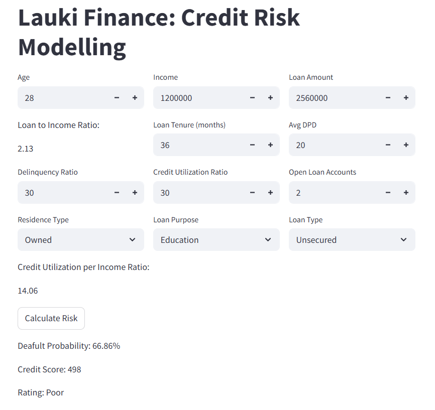

# 🧠 Risk Modeling ML Project

Welcome to the **Risk Model for a Non-Banking Loan Institution** — a machine learning project developed as part of the Codebasics ML Bootcamp. This project predicts loan default risk with high accuracy and explainability, and it's available as a fully interactive Streamlit web app! 🚀

---

## 📍 Project Overview

This end-to-end machine learning solution is designed to assess the **credit risk** of loan applicants for a fictitious **Non-Banking Financial Company (NBFC)**. The core goal is to help institutions identify high-risk customers and make informed lending decisions.

> **🎯 Objectives:**
>
> - Predict if a loan applicant will **default**
> - Maintain **recall > 90%** on default class (1)
> - Ensure **precision > 50%**
> - Provide **explainability** via SHAP plots and metrics

---

## 🌐 Live App

🖥 **Try the model yourself!** You can explore predictions and interpretability on the deployed app: 👉 [https://ml-project-risk-model.streamlit.app/](https://ml-project-risk-model.streamlit.app/)


---

## 📊 Model Results

| Metric              | Value  |
| ------------------- | ------ |
| AUC                 | 0.98   |
| Gini Coefficient    | 0.97   |
| KS Statistic        | 85.98% |
| Precision (class 1) | 0.56   |
| Recall (class 1)    | 0.95   |
| Accuracy            | 0.93   |

**Confusion Matrix Summary:**

```
              precision    recall  f1-score   support

           0       0.99      0.93      0.96     11423
           1       0.56      0.95      0.71      1074

    accuracy                           0.93     12497
   macro avg       0.78      0.94      0.83     12497
weighted avg       0.96      0.93      0.94     12497
```

---

## ⚙️ Tech Stack

- 🐍 Python
- 📊 Pandas, NumPy, Scikit-learn
- 📈 SHAP for model explainability
- 🎯 XGBoost Classifier
- 🌐 Streamlit for app deployment

---

## 🏁 How to Use Locally

Although there's a live app, you can also run it locally:

1. Clone this repo

```bash
git clone https://github.com/pedroabestard/ml-project-risk-model.git
cd ml-project-risk-model
```

2. Create a virtual environment & install dependencies

```bash
python -m venv .venv
source .venv/bin/activate  # On Windows: .venv\Scripts\activate
pip install -r requirements.txt
```

3. Run the app

```bash
streamlit run app.py
```

📌 *Note: Dataset has been removed due to privacy, but you can mock inputs using the UI.*

---

## 🙌 Acknowledgements

This project was created as part of the **ML Bootcamp by **[**Codebasics**](https://www.codebasics.io/) 💡. Huge thanks for the guidance and learning path!

---

## 📄 License

Feel free to fork or contribute to this project for learning purposes. For other uses, please reach out first.


---

## 🖼️ App screenshot



---

Made with ❤️ by [Pedro Bestard](https://github.com/pedroabestard)

